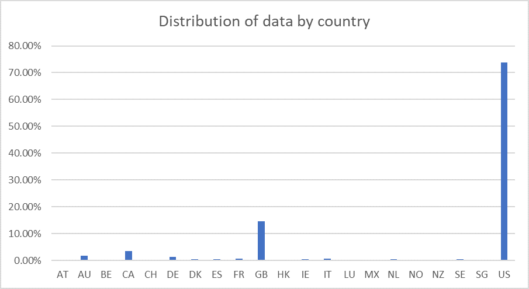

# Excel Homework: Kickstart My Chart

## Background

Over $2 billion has been raised using the massively successful crowdfunding service, Kickstarter, but not every project has found success. Of the more than 300,000 projects launched on Kickstarter, only a third have made it through the funding process with a positive outcome.

Getting funded on Kickstarter requires meeting or exceeding the project's initial goal, so many organizations spend months looking through past projects in an attempt to discover some trick for finding success. For this week's homework, you will organize and analyze a database of 4,000 past projects in order to uncover any hidden trends.

### About this repo

In this repo it is presented an analysis about succesful crowdfunding campains. It is analyzed which categories have more impact and what kind projects use to have more supoprt. Of course an important metric metric is the completion on time of the campaign, as well as the minimum fulfillment of the goals.

This analysis is presented in three files:

1. A pdf file with the most important insights.

2. An excel file with the analysis.

## Methodology

Using the Excel table provided, somo modifications and analysis was done. Data contains inormation of 4,000 past Kickstarter projects. In order to uncover some market trends the following excel procedures were performed:

* By using conditional formatting each cell in the `state` column was filled with a different color, depending on whether the associated campaign was successful, failed, or canceled, or is currently live.

* A new column called `Percent Funded` was created. In this column formula was used to uncover how much money a campaign made to reach its initial goal.

* Also each cell in the `Percent Funded` column was colored using a three-color scale and conditional formating. The scale started at 0 and had a dark shade of red, transitioning to green at 100, and blue at 200.

* Through a formula a new column was creanted and called `Average Donation` . This is done to uncover how much each backer for the project paid on average.

* Also, to new columns were created. One was called `Category` and the other one `Sub-Category`. The columns were fileld by spliting the `Category and Sub-Category` column into two parts.

  

  * On the other handa, a pivot table was created in a new sheet. The purpose was to analyze the initial worksheet and count how many campaigns were successful, failed, canceled, or are currently live per **category**.

  * In the same new sheet a stacked column pivot chart that can be filtered by country was created. Such a chart was based on the pivot table previusly created.

  

  * Similarly to the last two points a new pivot table and stacked column pivot chart is done but now it is analyzed how many campaigns were successful, failed, or canceled, or are currently live per **sub-category**.

  * The dates stored within the `deadline` and `launched_at` columns use Unix timestamps, therefore they were converted to a normal data by using a [formula.](https://www.extendoffice.com/documents/excel/2473-excel-timestamp-to-date.html). Two new columns where created with such conversions and named `Date Created Conversion` and `Date Ended Conversion`.

  

  * Also, a new sheet was created with a pivot table with a column of `state`, rows of `Date Created Conversion`, values based on the count of `state`, and filters based on `parent category` and `Years`. Then, a pivot chart line graph that visualizes this new table  was done.

  *As a bonus, a a new sheet with 8 columns was created. The columns were named:  `Goal`, `Number Successful`, `Number Failed`, `Number Canceled`, `Total Projects`, `Percentage Successful`, `Percentage Failed`, `Percentage Canceled`. In the goal column, 12 rows were created with the following headers:

  * Less than 1000
  * 1000 to 4999
  * 5000 to 9999
  * 10000 to 14999
  * 15000 to 19999
  * 20000 to 24999
  * 25000 to 29999
  * 30000 to 34999
  * 35000 to 39999
  * 40000 to 44999
  * 45000 to 49999
  * Greater than or equal to 50000

  

* The columns called `Number Successful`, `Number Failed`, and `Number Canceled` where populated by using the `COUNTIFS()` formula. The goal was to count how many successful, failed, and canceled projects were created with goals within the ranges listed above. columns with this data.

* Then each of the values in the `Number Successful`, `Number Failed`, and `Number Canceled` columns where added up to populate the `Total Projects` column. Then, using a mathematical formulathe percentage of projects that were successful, failed, or canceled per goal range were estimated.

* Also, a line chart that graphs the relationship between a goal's amount and its chances at success, failure, or cancellation was included.

## Statistical Analysis

If one were to describe a successful crowdfunding campaign, most people would use the number of campaign backers as a metric of success. One of the most efficient ways that data scientists characterize a quantitative metric, such as the number of campaign backers, is by creating a summary statistics table.

In order to obtain these metrics, the number of backers of successful and unsuccessful campaigns  were evaluated by creating a summary statistics table. To do so, the following steps were followed.

* A new worksheet was created were a column for each count of backers of successful campaigns and unsuccessful campaigns was estimated.

  

* Also, for successful campaigns, and then for unsuccessful campaigns the following statistical metrics were computed:

  * The mean number of backers.

  * The median number of backers.

  * The minimum number of backers.

  * The maximum number of backers.

  * The variance of the number of backers.

  * The standard deviation of the number of backers.

* Finaly, by using the data it was determined whether the mean or the median summarizes the data more meaningfully, and also if there is more variability with successful or unsuccessful campaigns. Does this make sense? Why or why not?

## Results

The dataset is composed of 4114 projects with a very wide range of categories and subcategories. The data base is distributed between four categories of successful and unsuccessful campaigns, as shown in Table 1.

| Succes of the campaign | Number of campaigns |
| --- | ----------- |
| canceled | 349 |
| failed | 1530 |
| live | 50 |
| successful | 2185 |
| Total | 4114 |

Table 1. Distribution of campaigns according to their success.

Therefore, it might be useful to analyze trends of successful campaigns. It is also noticeable that the database is disaggregated by country as shown in Figure R1.

Figure R1. Distribution of data by country

Most of the data came from English-speaking countries, and to a less extent from other countries, like Mexico.  Therefore, some caution must be taken when generalizing conclusions to all the countries. Also, the data is partitioned by project category and subcategory. Particularly, by category the campaigns are distributed as shown in Table 2.

| Category | Number of campaigns |
| --- | ----------- |
| film & video | 520 |
| food | 200 |
| games | 220 |
| journalism | 24 |
| music | 700 |
| photography | 220 |
| publishing | 237 |
| technology | 600 |
| theater | 1393 |
| Total | 4114 |

Table 2. Campaign categories

As we can observe most of the campaigns belong to the theater category, followed by music and technology.  It is also possible to divide de campaigns into subcategories. The subcategories are divided as shown in Table 3.

| Category | Number of subcategories | Most common subcategory |
| --- | ----------- | ----------- |
| theater | 3 | plays|
| music | 9 | indie rock|
| technology | 6 | wearables |
| film & video| 6 | documentary |
| publishing |6 | nonfiction |
| games | 3 | video games |
| photography | 4 | photobooks |
| food | 3 | food trucks |
| journalism | 1 | audio |

Table 3. Number of subcategories per category.

Other data that is analyzed is the number of backers that funded the campaign, the goal fixed in each campaign, the pledge gathered by each campaign, the date when the campaign was launched, and the date when the campaign finished.

### First conclusions from data

In global, more than half of the studied campaigns where successful, where the highest rate of success is for campaigns that are focused in music, theater, and film & video. On the other hand, the highest rates of fail occur in the food, games and publishing categories, while all the journalism campaigns were canceled. Also, most of the successful campaigns fulfil their goal and more.
On the other hand, in a subcategory level the higher probability of success is located in campaigns of rock  (music), and documentary (film and arts), while the less probability of success is located in food trucks (food), wearables (technology), and animation (film and video). The play subcategory from the theater category dominates de probabilities of success and also of fail, but this could be due to the fact that most of the observations are from this subcategory.
There are few live campaigns, and are distributed among theater, music and food. These campaigns are located in the United States (33), Great Britain (8), Mexico (3), France (2) and one in Canada, Austria, Ireland and Netherlands. This could be due to the fact that the data base only contains data of the first months in 2017. 
Also, in average if a project started in February, May or June has big chances to succeed, while if it starts in January, July or October it has big chances to fail.

### Limitations of the dataset

There are some limitations than has to be considered when using the conclusions above, and are:
1.	Even the data set is global, it contains more information about campaigns in the US in comparison with other countries, therefore the conclusions might apply only to the US
2.	The number of projects is not evenly distributed in time. The years with mor projects are 2014 (976), 2015 (1225) and 2016 (950). Also, there are year with only one kind of campaign. 
3.	In order to make a fair comparison between the amount of the goal and the pledge by country, the amounts should be standardized to a given currency and base year, for example dollars PPP (purchasing power parity).
4.	There is a big range between the number of backers, the goal and the pledge.
5.	There might be some bias since most of the campaigns are in the theater category. However, this could be a natural trend and more investigation about the structure and rules of the Kickstarter crowdfunding service is required.

### Future work for better understanding data

It could be interesting to analyze which are the most expensive campaigns according to their success, their category and subcategory.  This could be achieved through a stacked bar graph of different ranges of goal for category, subcategory and also success. The same could be done for pledge.
Another important fact could be to understand the campaigns with more backers by category. In this way we could try to figure out which projects are more interesting to people in a given country. This could be achieved through a pivot table than has in its rows the category, in the column the number of backers (as a sum) and filter by country. 
Finally, learning more about backers might help to decide where is appropriate to launch a given kind of campaign in order to get a success. For this, it might be useful to make a pivot table that in its rows has the subcategories, in its columns the mean of the average donation, and filtered it by country.

- - -
Author: Adriana Avalos Vargas based on md file from TES
© 2019 Trilogy Education Services
